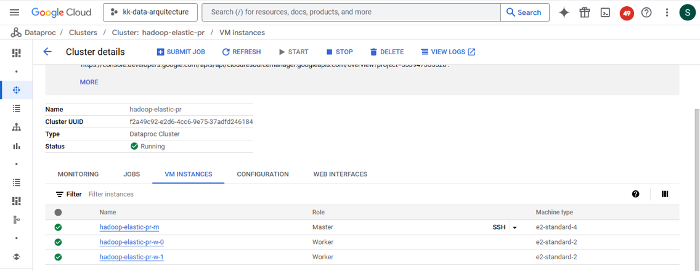
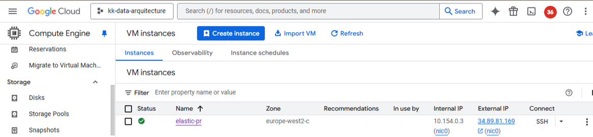
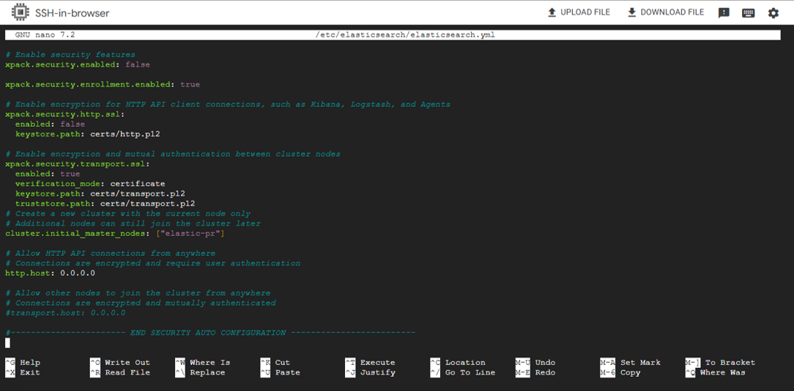
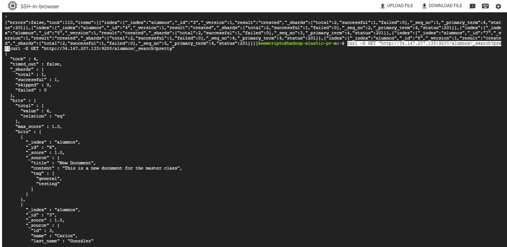
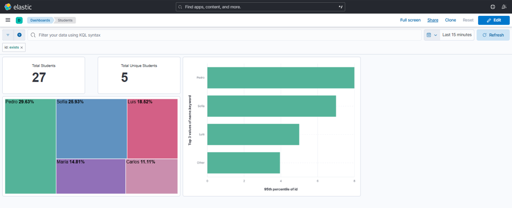

# Data-Arquitecture
Project focused on configuring and integrating a Hadoop cluster in Google Cloud Platform with an ElasticSearch server, enabling data indexing and visualization through Kibana.

---

## 📌 Table of Contents

1. [Hadoop Cluster Setup](#-hadoop-cluster-setup-gcp)  
2. [ElasticSearch Server Setup](##-elasticsearch-server-setup)  
3. [Connecting Hadoop to ElasticSearch](##-connecting-hadoop-to-elasticsearch)  
4. [Index Creation in ElasticSearch](##-index-creation-in-elasticsearch)  
5. [Data Visualization in Kibana](#-data-visualization-in-kibana)

---

## 1. Hadoop Cluster Setup

### Cluster creation in Dataproc  
Setup of a Hadoop cluster using **Dataproc** on Google Cloud Platform. Configuration included number of nodes, Hadoop version, and network settings.



### Bucket creation in Google Cloud Storage  
A bucket was created to store required JAR files for ElasticSearch integration.

### Uploading JAR files to the bucket  
Upload of the following JAR files into the bucket:

- [elasticsearch-hadoop-x.x.x.jar](https://github.com/IrisMejuto/Data-Arquitecture/blob/main/files/elasticsearch-hadoop-8.14.1.zip)
- [commons-httpclient-3.1.jar](https://github.com/IrisMejuto/Data-Arquitecture/blob/main/files/commons-httpclient-3.1.jar)


### Transferring JAR files to the cluster  
Files were copied from the bucket to the Hadoop cluster nodes using:

```bash
gsutil cp gs://bucket-elastic-pr/commons-httpclient-3.1.jar .

gsutil cp gs://bucket-elastic-pr/elasticsearch-hadoop-8.14.1.jar .

```


## 2. ElasticSearch Server Setup

### Virtual Machine creation  
Creation of a virtual machine (type `e2-medium`) to host ElasticSearch and Kibana. Configuration steps included:

- Selecting Ubuntu as the operating system  
- Enabling HTTP/HTTPS traffic  
- Opening ports `9200` (ElasticSearch) and `5601` (Kibana)  
- Assigning a static external IP



---

### Installation of ElasticSearch and Kibana  

Installation of required tools and packages on the virtual machine. Access to the VM was done via SSH:

#### Step 1: Install `wget`  
Installation of `wget` to enable downloading of installation packages:

```bash
sudo apt install wget
```

#### Step 2: Download latest versions of ElasticSearch and Kibana  

Download of `.deb` installation packages for ElasticSearch and Kibana (version 8.14.1):

```bash
wget https://artifacts.elastic.co/downloads/elasticsearch/elasticsearch-8.14.1-amd64.deb
wget https://artifacts.elastic.co/downloads/kibana/kibana-8.14.1-amd64.deb
```

#### Step 3: Install ElasticSearch and Kibana  

Installation of the downloaded packages using `dpkg`:

```bash
sudo dpkg -i elasticsearch-8.14.1-amd64.deb
sudo dpkg -i kibana-8.14.1-amd64.deb
```

#### Step 4: Configure Kibana for external access  

The following line was appended to the Kibana configuration file to allow external access from any host:

```bash
sudo sed -i -e '$aserver.host: 0.0.0.0' /etc/kibana/kibana.yml
```

The configuration was verified with:

```bash
sudo cat /etc/kibana/kibana.yml
```

---

#### Step 5: Adjust ElasticSearch configuration  

ElasticSearch settings were updated manually by editing the main configuration file:

```bash
sudo nano /etc/elasticsearch/elasticsearch.yml
```

The following parameters were set to `false` to disable security features for simplified local access (not recommended in production environments):



---

#### Step 6: Restart services  

After configuration, both services were restarted to apply changes:

```bash
sudo service elasticsearch restart
sudo service kibana restart
```

---

## 3. Connecting Hadoop to ElasticSearch

Once the ElasticSearch server has been configured and the required JAR files have been transferred to the Dataproc cluster master node, the next step involves modifying Hive’s configuration to enable connectivity with ElasticSearch.

### Step 1: Modify `hive-site.xml`

The `hive-site.xml` configuration file was updated using `sed` to add the necessary ElasticSearch properties and JAR references.

```bash
# Remove the last line of the configuration file
sudo sed -i '$d' /etc/hive/conf.dist/hive-site.xml

# Add ES connection properties
sudo sed -i '$a \  <property>\n    <name>es.nodes</name>\n    <value>35.234.149.191</value>\n  </property>\n' /etc/hive/conf.dist/hive-site.xml

sudo sed -i '$a \  <property>\n    <name>es.port</name>\n    <value>9200</value>\n  </property>\n' /etc/hive/conf.dist/hive-site.xml

sudo sed -i '$a \  <property>\n    <name>es.nodes.wan.only</name>\n    <value>true</value>\n  </property>\n' /etc/hive/conf.dist/hive-site.xml

# Reference the ElasticSearch and HttpClient JAR files
sudo sed -i '$a \  <property>\n    <name>hive.aux.jars.path</name>\n   <value>/usr/lib/hive/lib/elasticsearch-hadoop-8.14.1.jar,/usr/lib/hive/lib/commons-httpclient-3.1.jar</value>\n  </property>\n</configuration>' /etc/hive/conf.dist/hive-site.xml
```

### Step 2: Move required JAR files to Hive library path

```bash
sudo cp elasticsearch-hadoop-8.14.1.jar /usr/lib/hive/lib/
sudo cp commons-httpclient-3.1.jar /usr/lib/hive/lib/
```

---


### Step 3: Restart Hive after applying these configuration changes for them to take effect.

```bash
sudo service hive-server2 restart
```

---

## 4. Indexing Data into ElasticSearch

Before proceeding, ensure that the appropriate **firewall rules** have been configured (as established in Part 2) to allow access to port `9200` from the Hadoop cluster to the ElasticSearch server.

---

### Step 1: Create an index in ElasticSearch  

From the ElasticSearch server, a new index named `alumnos` was created using the following `curl` command:

```bash
curl -X POST "localhost:9200/alumnos/_doc/6" -H 'Content-Type: application/json' -d'
{
  "title": "New Document",
  "content": "This is a new document for the master class",
  "tag": ["general", "testing"]
}'
```

---

### Step 2: Insert bulk data into the index from Hadoop  

Using the `_bulk` API, multiple documents were indexed into the `alumnos` index from the Hadoop cluster:

```bash
curl -X POST "http://<ELASTICSEARCH-IP>:9200/_bulk" -H 'Content-Type: application/json' -d'
{ "index": { "_index": "alumnos", "_id": "3" } }
{ "id": 3, "name": "Carlos", "last_name": "González" }
{ "index": { "_index": "alumnos", "_id": "4" } }
{ "id": 4, "name": "María", "last_name": "López" }
{ "index": { "_index": "alumnos", "_id": "5" } }
{ "id": 5, "name": "Luis", "last_name": "Martínez" }
{ "index": { "_index": "alumnos", "_id": "7" } }
{ "id": 7, "name": "Sofía", "last_name": "Ramírez" }
{ "index": { "_index": "alumnos", "_id": "8" } }
{ "id": 8, "name": "Pedro", "last_name": "Hernández" }
'
```

---

### Step 3: Verify indexed data  

To confirm that the documents were successfully indexed, a basic search query was performed:

```bash
curl -X GET "http://<ELASTICSEARCH-IP>:9200/alumnos/_search?pretty"
```


```
---

```
## 5.Data Visualization in Kibana

This optional section focuses on exploring **Kibana** to create a basic dashboard. The goal is to become familiar with the tool and visualize the data indexed in ElasticSearch.


Open a web browser and navigate to the Kibana instance:

```
http://<ELASTICSEARCH-IP>:5601
```


